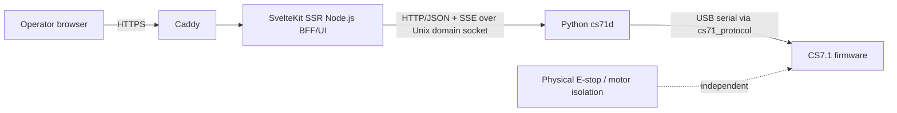

# Raspberry Pi 5 CS7.1 Control Appliance — Executive Summary

> **Canonical detailed architecture:** [docs/architecture/README.md](docs/architecture/README.md). This document is an executive summary, not a competing source of normative detail. Firmware wire behavior remains canonical in [ArduinoCode/PROTOCOL_V2.md](ArduinoCode/PROTOCOL_V2.md), and the existing host-library scope remains canonical in [host/README.md](host/README.md).

## Direction

The MVP is a native Raspberry Pi OS appliance for one CS7.1 controller:

- SvelteKit is the browser-facing SSR application and BFF. The browser never reaches `cs71d`, USB or serial directly.
- Python `cs71d` is the sole serial owner and uses the existing `cs71_protocol` boundary. A dedicated worker serializes machine I/O.
- The internal daemon API is versioned HTTP/JSON over a Unix domain socket; commands use REST and updates use SSE, not WebSocket for MVP.
- `cs71d` and SvelteKit own separate SQLite databases; they correlate with `operation_id` and never share writes.
- systemd, udev stable device identity and Caddy provide the native deployment model; containers are excluded from MVP.

## Safety and evidence boundary

A command is not user-complete until `cs71d` records a trusted, correlated firmware terminal. Timeout, disconnect, malformed/CRC/interleaved data, failed recovery or journaling failure is never represented as success; it produces failure or `UNCERTAIN`. Priority software stop bypasses ordinary work, but it is **not an E-stop**. Physical energy isolation remains independent.

Linux/POSIX DTR behavior is **NOT_EXECUTED** and unqualified. The current host transport deliberately guarantees pre-open DTR suppression only for the Windows pyserial backend. Raspberry Pi unattended/pilot operation requires the instrumented DTR experiment and hardware gate described in [deployment-and-operations.md](docs/architecture/deployment-and-operations.md). Simulator evidence cannot satisfy DTR, physical motion, stop, USB or HIL gates.

## Where to read details

| Need | Canonical document |
| --- | --- |
| goals, scope and targets | [vision-and-scope.md](docs/architecture/vision-and-scope.md) |
| boundaries and failures | [system-context.md](docs/architecture/system-context.md) |
| worker, state, recovery and stop | [runtime-and-domain.md](docs/architecture/runtime-and-domain.md) |
| daemon REST/SSE contract | [api-and-events.md](docs/architecture/api-and-events.md) |
| persistence, security and deployment | [data-and-persistence.md](docs/architecture/data-and-persistence.md), [security-and-safety.md](docs/architecture/security-and-safety.md), [deployment-and-operations.md](docs/architecture/deployment-and-operations.md) |
| quality evidence, roadmap and PR tasks | [testing-and-quality.md](docs/architecture/testing-and-quality.md), [roadmap.md](docs/architecture/roadmap.md), [backlog.md](docs/architecture/backlog.md) |
| accepted decisions and traceability | [adr/README.md](docs/architecture/adr/README.md), [traceability.md](docs/architecture/traceability.md) |
