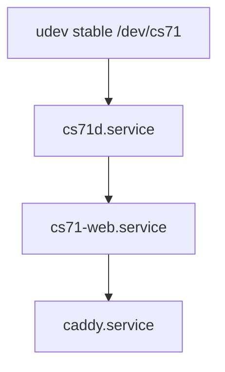

# Deployment and Operations

## Baseline and layout

MVP deploys natively on supported 64-bit Raspberry Pi OS for Raspberry Pi 5; containers are not part of MVP. Before pilot, record OS image, kernel, firmware, Node/Python versions, USB adapter identity and appliance build metadata. Installation layout:

```text
/opt/cs71/web/                 SvelteKit production bundle
/opt/cs71/daemon/              Python environment and cs71d
/etc/cs71/cs71d.toml           daemon config, root-owned
/etc/cs71/web.env              web secrets/config, root-owned
/etc/cs71-web/service-token    daemon credential the web service presents, owner-only
/var/lib/cs71d/machine.db      daemon-owned SQLite
/var/lib/cs71-web/web.db       web-owned SQLite
/run/cs71/cs71d.sock           runtime Unix domain socket
```

Use `cs71d` user/group for daemon state and serial device access, `cs71-web` user for SvelteKit, and a narrow `cs71-api` group for socket connection. Caddy runs with its normal service account and reaches SvelteKit on loopback only. Persistent directories are created with installer-defined owner/mode; `/run` is created by systemd runtime-directory support.

## Device identity and services

A udev rule matches the approved USB VID/PID **and serial number** and creates `/dev/cs71` with group access for `cs71d`; it must not match every generic USB serial adapter. Installation verifies the symlink resolves to the intended physical adapter before enabling automatic start.



`cs71d.service` is ordered after device availability and local filesystems, owns `/run/cs71`, reads its restricted config, and is restarted on failure with bounded backoff. `cs71-web.service` starts after `cs71d` but tolerates daemon unavailability and retries only at the BFF boundary. Caddy starts after network/loopback web readiness. Service sandboxing follows [security-and-safety.md](security-and-safety.md): separate users, `NoNewPrivileges`, read/write path allow-lists, address-family restrictions, resource limits and explicit serial device access. Verify each setting against pyserial, SQLite and Node behavior rather than assuming a generic hardening profile works.

## Caddy and configuration

Caddy binds the configured LAN HTTPS endpoint and proxies only to `127.0.0.1:<web-port>`. It sets reasonable request/idle timeouts for browser SSE and does not expose `/run/cs71/cs71d.sock`, the daemon API, static secrets or SQLite files. TLS uses the configured local trust/public PKI route; profile policy determines whether development HTTP is permitted.

Daemon config includes fixed device identity/path, serial/protocol limits, bounded queue/event retention, database paths, journal/disk thresholds, supported configuration allow-list, DTR policy and logging level. Web config includes socket path, cookie/TLS origin policy, bootstrap state and rate limits. Config changes are schema-validated, ownership/mode checked, audited and require service restart only where documented. Never accept device paths, executable commands or raw protocol strings from web requests.

## Install, upgrade and rollback

1. Verify signed/reviewed release artifact, manifest, architecture and free disk.
2. Create a consistent backup and record installed version/config checksum.
3. Stop web then daemon writers; retain Caddy maintenance/health behavior as documented.
4. Install versioned artifacts beside the current release; run database migrations and integrity/readiness checks.
5. Start daemon, establish allowed readiness state, then start web and Caddy; smoke test from an authenticated profile.
6. On failure before irreversible migration, stop services, restore the prior artifact/config/database backup, start daemon then web, and record the rollback outcome.

Rollback never assumes an interrupted motion completed. If migration or daemon recovery fails, leave the machine not-ready/`UNCERTAIN`; use the recovery runbook. Upgrade and rollback drills are pilot gates.

## Backups, observability and runbooks

Back up both SQLite stores using consistent SQLite methods, plus config and manifests; encrypt any off-appliance copy. Verify restoration regularly. Backup failure, integrity failure, disk threshold and WAL/checkpoint error are observable and block new daemon state-changing work as defined in [data-and-persistence.md](data-and-persistence.md).

Structured journald logs include UTC timestamp, service/version, severity, `operation_id`, daemon `event_id`, snapshot generation and `X-Request-ID` where available; never log passwords/cookies/secrets. Minimum metrics/health signals: uptime/version, service restart count, controller connection/protocol mode, generation, active operation/fault, reconnect/recovery count, protocol failures, event overflow, queue depth/latency, journal health, backup age and filesystem free space.

Runbooks cover: browser unavailable (verify Caddy/web without touching daemon); daemon unavailable (no claimed machine state); USB loss (`UNCERTAIN`, inspect, explicit recovery); journal/disk failure (stop new motion, preserve evidence, repair/restore); fault recovery; password/admin recovery; restore; upgrade rollback; and emergency response (use physical E-stop/power procedure, not UI stop as substitute). Each runbook gives prerequisites, commands owned by operations, expected evidence and abort conditions.

## Profiles

| Profile | Device/backend | Security/deployment rule | Evidence use |
| --- | --- | --- | --- |
| Development | simulator by explicit config | local HTTP allowed; no physical controller claim | unit/integration UX only |
| Staging | simulator plus controlled Pi smoke | production-like users/services/socket; no production actuation | deployment and regression evidence |
| Production/pilot | approved physical controller | TLS, udev, backups, service hardening and hardware gates required | operator use after gates |

Simulator selection is explicit and conspicuous; production config rejects simulator backend.

## DTR experiment plan — mandatory gate

Linux/POSIX pre-open DTR suppression is **NOT_EXECUTED**. The existing `SerialTransport` explicitly guarantees that pre-open behavior only for pyserial Windows backend; it rejects POSIX/macOS rather than making a physical-reset claim. Before unattended Linux operation, a technician must:

1. identify the exact Pi OS/kernel, USB adapter VID/PID/serial, controller, wiring and instrument setup;
2. measure DTR and reset behavior when opening/closing the port, including daemon restart and client/web crash;
3. repeat idle, representative motion, recovery and USB reconnect cases with motor-energy safeguards;
4. record raw measurements, firmware output, pass/fail criteria and reproducible configuration;
5. decide and document whether a safe qualified open/reset path exists, or install/qualify a hardware motor-enable interlock;
6. obtain safety/release approval and add automated/configuration guardrails for the conclusion.

Until all criteria pass, Linux DTR remains unqualified; no unattended/pilot production claim may use it as a safe pre-reset stop path.
