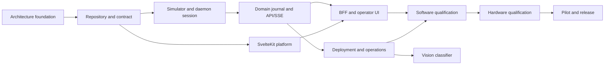

# Roadmap

Dates and sizes below are planning aids, not commitments. A milestone may advance only when its entry and exit criteria are evidenced; simulator completion never bypasses hardware gates.

| Milestone | Deliverables | Entry criteria | Exit criteria | Gate / rough size / parallelism |
| --- | --- | --- | --- | --- |
| M0 Architecture foundation | Canonical docs, ADRs, traceability | Existing protocol/host boundaries understood | Decisions accepted; safety/evidence boundaries explicit | No hardware; S; enables contract and platform streams |
| M1 Repository and contract | Workspaces, CI, OpenAPI baseline | M0 | Reproducible no-hardware build and contract checks | No hardware; M; platform/API can parallelize |
| M2 Simulator and daemon session | Deterministic simulator, sole serial worker/session states | M1 | Protocol fixture parity and fail-closed simulated recovery | No hardware; L; simulator/session pair sequential |
| M3 Domain, journal, API/SSE | Scheduler, durable operations, Unix-socket API/event ring | M2 | Stop, idempotency, stale generation and overflow tests | No hardware; L; API and persistence overlap after domain model |
| M4 SvelteKit platform | SSR shell, auth/RBAC/CSRF and web persistence | M1 | Server-side auth controls pass without daemon access | No hardware; M; runs in parallel with M2/M3 |
| M5 BFF and operator UI | Generated client, Unix-socket bridge, SSE reconciliation and MVP screens | M3 and M4 | Browser cannot bypass BFF; simulated Node restart isolation and complete workflows pass | No hardware; L |
| M6 Appliance operations | systemd/udev/Caddy, backups, upgrade/rollback and clean install | M3 and M4 | Simulated end-to-end workflow and clean Pi install/restore evidence | Pi required; L; can overlap M5 |
| M7 Software qualification | Contract, stress, NFR-01/NFR-02 Pi profile, security and a11y evidence | M5 and M6 | All software gates green; no unresolved critical safety defects | Raspberry Pi 5 required; controller not required; L |
| M8 Hardware qualification | DTR, parity, stop, fault, USB/reboot HIL evidence | M7 and approved rig/procedure | DTR decision closed; hardware gates passed or appliance restricted accordingly | Required controller/rig; XL, serialize safety-critical rig work |
| M9 Controlled pilot/release | operator pilot, runbook/rollback drill, release record | M8 | Pilot exit criteria and approvals met | Required qualified hardware; L |
| M10 Vision classifier | `cs71-vision` service, self-labeled dataset, operator-trained/activated model, confidence-gated hybrid autonomy, primer-presence confirmation gate | M6 | Self-labeled data collection and a read-only classifier run with recorded per-class accuracy on real Pi + camera; autonomy and primer gate wired and simulator-evidenced | Pi and camera required; controller only for autonomous-sort acceptance (also needs M8's closed DTR gate); XL; can overlap M7–M9 |

## Current implementation status

- M0 and M1 are complete.
- M2 simulator and adverse-fixture work is complete.
- The protocol boundary supports deadline-preserving interrupt polling and
  trusted same-owner out-of-band stop.
- PI-DAEMON-001 is complete: `cs71d.SerialWorker` is the sole serial owner,
  with bounded normal admission, an independently admitted priority-stop lane,
  and fail-closed preemption and uncertainty results.
- PI-DAEMON-002 is complete: connection state is published with a monotonic
  snapshot generation, recovery is delegated to `cs71_protocol` and escalates
  to reconnect without replaying an incomplete command, and opening a real
  POSIX serial port is refused while the DTR gate is `NOT_EXECUTED`.
- M2 is therefore complete and M3 is open.
- PI-DOMAIN-001 is complete: operations are durable in `machine.db`, admission
  evaluates idempotency, snapshot generation and readiness atomically before
  any serial enqueue, every material transition advances one machine-wide
  generation, and `SUCCEEDED` requires a trusted correlated firmware terminal.
  An unverified terminal now resolves as `UNCERTAIN`, which closes the
  assertion PI-SIM-002 deferred.
- PI-DOMAIN-002 is complete: a refused journal write latches the machine as
  undurable, blocks new motion with `JOURNAL_UNAVAILABLE` and cannot yield an
  unrecorded successful operation, and a lifecycle write that fails stops the
  command before transmission. Priority stop is an attributable durable
  operation that bypasses queued normal work; without its trusted exact
  `stopped` terminal, the stop and the work it affected are `UNCERTAIN`.
- PI-DOMAIN-003 is complete for home and sort: the worker gathers advertised
  capabilities and observed readiness before publishing `READY`, and the
  adapters refuse an unadvertised axis, an out-of-range slot or an unknown
  sorter position before any serial I/O. Feed returns `UNSUPPORTED` because
  its firmware lifecycle gate is `NOT_EXECUTED`; its operation coverage stays
  blocked on V2-09 and hardware evidence, so the PI-DOMAIN epic exit criteria
  are met only for the operations the firmware actually implements.
- PI-API-001 is complete.
  The daemon serves health, snapshot and operation resources over a Unix
  domain socket only, with owner/group-only permissions and a bearer service
  credential on every request; responses are checked against the frozen
  contract, and the home, sort, feed and priority-stop commands are served
  with their required idempotency, generation and deadline headers, and
  `cs71d --serve` runs the assembled daemon behind a protected service
  credential. `/v1/session/connect` and `/v1/session/recover` are served by
  the new PI-DOMAIN-004 session operations, and `/v1/configuration` is served
  by its configuration domain. PI-DOMAIN-004 and PI-API-001 are therefore
  complete. PI-API-002 is complete for stream behaviour: events carry a
  monotonic daemon `event_id`, `Last-Event-ID` resumes retained events, a stale
  or foreign cursor and a slow subscriber both force `snapshot.required`, and a
  disconnected consumer cannot stall the serial worker. Event retention is in
  memory only, so durable replay across a restart remains outstanding. M3 is
  therefore substantially complete and M5 is unblocked.
- PI-WEB-001 is complete for its software criteria. `web.db` is owner-only with
  forward-only checksummed migrations, passwords are Argon2id under a single
  policy, sessions are opaque and server-side with idle and absolute bounds,
  rotation on login and revocation on logout, expiry, disable and password
  change, and the first administrator can only be created by claiming a one-time
  expiry-bound bootstrap token. A stolen `web.db` yields no usable credential.
  The request hook denies by default and the session cookie is `HttpOnly`,
  `SameSite=Strict` and root-scoped, `Secure` and `__Host-` prefixed in
  production. The installer command that prints a bootstrap token is now
  delivered, in PI-OPS-001.
- PI-WEB-002 is complete for role enforcement. The documented RBAC matrix is
  transcribed once as data and asserted role by role and capability by
  capability, including the viewer's software stop and the protocol path no role
  holds. Every route declares what it requires, the hook authorizes before any
  page or action runs, a route with no declaration is refused, and a spec scans
  the route directory so an undeclared page fails the build. State-changing
  requests must name the appliance's own origin and echo back a token a forging
  page cannot read, and they are bounded by documented rate, concurrency and
  size budgets. PI-WEB-002 is therefore complete for its software criteria, so
  M4's exit criterion — server-side authentication and authorization controls
  passing without daemon access — is met by software evidence.
- PI-BFF-001 is complete for its software criteria. The daemon client is
  socket-only with no host, port or URL, exposes named commands with typed
  arguments and no protocol pass-through, supplies idempotency, generation and
  deadline on every command, translates daemon errors into wording this
  workspace owns, and reads its service credential from a protected file. The
  dashboard reads the snapshot and submits the software stop, authorizing in the
  action before the daemon call, showing an `operation_id` and a pending state
  rather than a completion, and writing a `web_audit` row in `web.db` for every
  attempt without a transaction across the two databases. Connect, home, sort,
  feed and recovery now have screens, delivered in PI-UI-001 and PI-UI-002;
  configuration remains client-only, and no backlog item yet owns its screen.
- PI-BFF-002 is complete for its software criteria. One reader of the daemon's
  event stream is fanned out to every open browser over SSE behind
  `machine.read`; it attaches on the first subscriber and lets go after the last.
  It resumes from the daemon's own `event_id`, announces a `resync` on every
  reconnection and whenever a cursor cannot be resumed, passes daemon identifiers
  through unrenumbered, and reconnects only a reader — never a command. Nothing
  waits for a browser: one that falls behind is told to read a snapshot and one
  that vanishes cannot slow daemon event production or the serial worker. The
  browser builds no machine state out of an event — an event means the screen is
  behind, and that is resolved by reading a snapshot — and a restart of this
  service drops a database handle and a reader and nothing else, so it can
  neither cancel nor duplicate an operation the daemon is running. M5's exit
  criteria are now met: PI-OPS-001 delivers the installer command that prints
  a bootstrap token, which was the one remaining piece.
- PI-UI-001 is complete: the dashboard, manual controls and operation history
  are delivered.
  What a screen may say about the machine is decided in one tested module —
  acceptance is never worded as completion, a terminal the controller did not
  confirm is presented as an outcome that is not known, an unobserved axis
  reads "not known" rather than "not homed", and `UNCERTAIN` has a tone of its
  own. The software stop is the first control in the tab order and a
  keyboard-only spec drives it end to end from the rendered page to the daemon.
  Connect, home and sort are offered capability-driven from the snapshot the
  operator is looking at, every command form carries that snapshot's generation
  and a render-minted idempotency key, and the feed control follows the
  firmware capability — disabled today with the daemon's reason for the
  unqualified gate shown verbatim. The operation history screen at
  `/operations` reuses the dashboard's own per-operation wording for every
  row — an unsettled row is never worded as a completion and an unconfirmed
  terminal still reads as not known — filters on exactly the state and type
  values the contract defines, and pages forward on the daemon's own cursor.
- PI-UI-002 is complete: fault, recovery and system views are delivered.
  `UNCERTAIN` renders visually distinct from ordinary attention — bold,
  bordered and filled rather than color alone — so the two tones cannot be
  mistaken for each other at a glance. Recovery is a new dashboard control
  gated to `machine.recover`, decided independently of the operator controls:
  it is the way back from a session that is not known and a deliberate reset
  of a healthy one otherwise, and its form requires an explicit confirmation
  checkbox this workspace validates before anything reaches the daemon. The
  system view at `/system` shows the firmware version already in the
  snapshot, journal health captioned as inferred from recorded faults rather
  than a dedicated check, storage health explicitly reported as not available
  from this service, and DTR-gate status from a new `GET /v1/system` endpoint
  that serializes the daemon's existing `DTR_GATE_STATUS` constant —
  `NOT_EXECUTED` today, worded as the project's own evidence-status legend
  and never presented as a pass.
- PI-OPS-001 is delivered for the evidence class achievable without a Pi.
  `appliance/ops/install.sh` creates the documented users, group and
  directory layout, writes one shared service credential to each side's own
  copy, and installs least-privilege systemd units for `cs71d` and
  `cs71-web` plus a Caddy drop-in and a udev rule matching vendor ID, product
  ID and serial number together. `appliance/ops/tests/smoke-test.sh` is
  functional, not structural: on a real Linux host (the `appliance-ops` CI
  job) it starts the real services under their real sandbox directives —
  against the simulator backend, since `backend = "serial"` cannot start on
  any Linux host while Linux DTR is `NOT_EXECUTED`, Pi included — and proves
  the socket's owner and mode, that the web identity can reach the daemon
  through it and nothing else can reach the serial device, that Node stays up
  under the sandbox, and that a process carrying the daemon's own sandbox
  properties is kernel-refused when it tries to open a TCP socket. A real Pi
  install/reboot/backup drill, the approved adapter's actual identity and
  closing Linux DTR remain PI-HIL-001 and a future Pi drill, not software
  work — M5's exit criteria are met by this evidence class.
- PI-OPS-002 is delivered for the evidence class achievable without a Pi.
  `appliance/ops/backup.sh` takes a SQLite-consistent online backup of both
  databases plus configuration into a checksummed, versioned manifest, and
  never includes a service-token file; `systemd/cs71-backup.timer` runs it
  daily. `appliance/ops/restore.sh` verifies that manifest and each
  database's integrity before touching anything live, then stops web then
  daemon, installs the backup, and starts daemon then web with a read-only
  smoke test after each. `appliance/ops/upgrade.sh` backs up first, rebuilds
  both workspaces from the checkout the same way `install.sh` does, and rolls
  the release artifacts and data back through `restore.sh` on any failure
  before the web service is confirmed healthy on the new build — there is no
  separate migration-runner command in this codebase, so starting the daemon
  and the web service *is* applying their migrations. `cs71d`'s production
  profile now also carries a `DurabilityMonitor` that latches the machine
  exactly the way a failed journal write already does when free disk space or
  backup freshness crosses a fixed floor, surfaced on every readiness poll
  and checked before every admission. `appliance/ops/tests/smoke-test.sh`
  runs `backup.sh` and `restore.sh` for real in CI, including through the
  daemon's actual fixed unit names. A real Pi backup/restore/upgrade drill
  against the production profile and a real controller remains PI-HIL-001 and
  a pilot-gate drill, not software work — M6 stays open behind that
  Pi-hardware drill alone.
- Hardware-dependent firmware integration remains blocked; simulator evidence
  does not advance M8 qualification.
- M10 (PI-VISION) is newly planned, not started: ten PR-sized tasks
  decomposed from [ADR-0013](adr/0013-vision-classifier-service-and-hybrid-autonomy.md)
  bring manufacturer headstamp classification onto Uno + Pi 5 with no
  separate Windows PC, replacing today's external "AI Sorter". It adds a
  third appliance service, `cs71-vision`, self-labels its own training data
  from ordinary manual sorting, and only earns autonomy behind a per-class
  confidence threshold with rollback. Primer presence is a permanent,
  non-bypassable confirmation gate, never an autonomy candidate. M10 depends
  only on M6 and can run in parallel with M7–M9; the one piece that cannot
  close without M8 is a real autonomous sort actually moving the machine,
  since that still needs the DTR gate closed first like any other real
  motion on this appliance.

## Risks and mitigations

| Risk | Mitigation/decision point |
| --- | --- |
| Linux USB DTR reset behavior is unsafe or unprovable | Keep NOT_EXECUTED gate; qualify a hardware interlock or do not allow unattended deployment. |
| Firmware terminal semantics do not prove desired completion | Treat as incomplete evidence; adjust firmware/procedure and HIL before pilot. |
| SQLite/disk fault loses audit durability | Fault-inject, monitor thresholds, block new motion and restore-test. |
| BFF outage is mistaken for machine stop | Keep `cs71d` independent; test Node restart and show current daemon state after reconnect. |
| Scope expands into cloud/multi-machine system | Enforce MVP non-goals and ADR revisit process. |
| Primer-presence misclassification enables autonomous action on a physical-risk case | Primer axis is a permanent, code-enforced confirmation gate with no bypass (PI-VISION-010); never closed on software evidence alone, reviewed like DTR/HIL. |
| Thin/biased self-labeled dataset yields a confidently wrong model | Hard per-class minimum-example floor before training (PI-VISION-004); candidate accuracy shown before activation, with rollback (PI-VISION-005). |

Detailed task dependency and acceptance criteria are canonical in [backlog.md](backlog.md).
