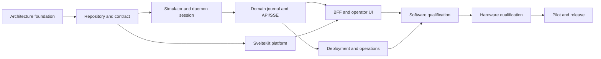

# Roadmap

Dates and sizes below are planning aids, not commitments. A milestone may advance only when its entry and exit criteria are evidenced; simulator completion never bypasses hardware gates.

| Milestone | Deliverables | Entry criteria | Exit criteria | Gate / rough size / parallelism |
| --- | --- | --- | --- | --- |
| M0 Architecture foundation | Canonical docs, ADRs, traceability | Existing protocol/host boundaries understood | Decisions accepted; safety/evidence boundaries explicit | No hardware; S; enables contract and platform streams |
| M1 Repository and contract | Workspaces, CI, OpenAPI baseline | M0 | Reproducible no-hardware build and contract checks | No hardware; M; platform/API can parallelize |
| M2 Simulator and daemon session | Deterministic simulator, sole serial worker/session states | M1 | Protocol fixture parity and fail-closed simulated recovery | No hardware; L; simulator/session pair sequential |
| M3 Domain, journal, API/SSE | Scheduler, durable operations, Unix-socket API/event ring | M2 | Stop, idempotency, stale generation and overflow tests | No hardware; L; API and persistence overlap after domain model |
| M4 SvelteKit platform | SSR shell, auth/RBAC/CSRF and web persistence | M1 | Server-side auth controls pass without daemon access | No hardware; M; runs in parallel with M2/M3 |
| M5 BFF and operator UI | Generated client, Unix-socket bridge, SSE reconciliation and MVP screens | M3 and M4 | Browser cannot bypass BFF; simulated Node restart isolation and complete workflows pass | No hardware; L |
| M6 Appliance operations | systemd/udev/Caddy, backups, upgrade/rollback and clean install | M3 and M4 | Simulated end-to-end workflow and clean Pi install/restore evidence | Pi required; L; can overlap M5 |
| M7 Software qualification | Contract, stress, NFR-01/NFR-02 Pi profile, security and a11y evidence | M5 and M6 | All software gates green; no unresolved critical safety defects | Raspberry Pi 5 required; controller not required; L |
| M8 Hardware qualification | DTR, parity, stop, fault, USB/reboot HIL evidence | M7 and approved rig/procedure | DTR decision closed; hardware gates passed or appliance restricted accordingly | Required controller/rig; XL, serialize safety-critical rig work |
| M9 Controlled pilot/release | operator pilot, runbook/rollback drill, release record | M8 | Pilot exit criteria and approvals met | Required qualified hardware; L |

## Current implementation status

- M0 and M1 are complete.
- M2 simulator and adverse-fixture work is complete.
- The protocol boundary supports deadline-preserving interrupt polling and
  trusted same-owner out-of-band stop.
- PI-DAEMON-001 is complete: `cs71d.SerialWorker` is the sole serial owner,
  with bounded normal admission, an independently admitted priority-stop lane,
  and fail-closed preemption and uncertainty results.
- PI-DAEMON-002 is complete: connection state is published with a monotonic
  snapshot generation, recovery is delegated to `cs71_protocol` and escalates
  to reconnect without replaying an incomplete command, and opening a real
  POSIX serial port is refused while the DTR gate is `NOT_EXECUTED`.
- M2 is therefore complete and M3 is open.
- PI-DOMAIN-001 is complete: operations are durable in `machine.db`, admission
  evaluates idempotency, snapshot generation and readiness atomically before
  any serial enqueue, every material transition advances one machine-wide
  generation, and `SUCCEEDED` requires a trusted correlated firmware terminal.
  An unverified terminal now resolves as `UNCERTAIN`, which closes the
  assertion PI-SIM-002 deferred.
- PI-DOMAIN-002 is complete: a refused journal write latches the machine as
  undurable, blocks new motion with `JOURNAL_UNAVAILABLE` and cannot yield an
  unrecorded successful operation, and a lifecycle write that fails stops the
  command before transmission. Priority stop is an attributable durable
  operation that bypasses queued normal work; without its trusted exact
  `stopped` terminal, the stop and the work it affected are `UNCERTAIN`.
- PI-DOMAIN-003 is complete for home and sort: the worker gathers advertised
  capabilities and observed readiness before publishing `READY`, and the
  adapters refuse an unadvertised axis, an out-of-range slot or an unknown
  sorter position before any serial I/O. Feed returns `UNSUPPORTED` because
  its firmware lifecycle gate is `NOT_EXECUTED`; its operation coverage stays
  blocked on V2-09 and hardware evidence, so the PI-DOMAIN epic exit criteria
  are met only for the operations the firmware actually implements.
- PI-API-001 is partially delivered and remains the active critical-path step.
  The daemon serves health, snapshot and operation resources over a Unix
  domain socket only, with owner/group-only permissions and a bearer service
  credential on every request; responses are checked against the frozen
  contract. The state-changing endpoints, the session and configuration
  resources, and the daemon entry-point wiring are outstanding.
  PI-WEB-001 remains independently available in parallel.
- Hardware-dependent firmware integration remains blocked; simulator evidence
  does not advance M8 qualification.

## Risks and mitigations

| Risk | Mitigation/decision point |
| --- | --- |
| Linux USB DTR reset behavior is unsafe or unprovable | Keep NOT_EXECUTED gate; qualify a hardware interlock or do not allow unattended deployment. |
| Firmware terminal semantics do not prove desired completion | Treat as incomplete evidence; adjust firmware/procedure and HIL before pilot. |
| SQLite/disk fault loses audit durability | Fault-inject, monitor thresholds, block new motion and restore-test. |
| BFF outage is mistaken for machine stop | Keep `cs71d` independent; test Node restart and show current daemon state after reconnect. |
| Scope expands into cloud/multi-machine system | Enforce MVP non-goals and ADR revisit process. |

Detailed task dependency and acceptance criteria are canonical in [backlog.md](backlog.md).
