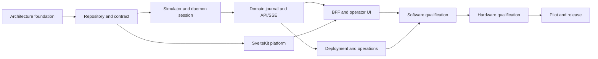

# Roadmap

Dates and sizes below are planning aids, not commitments. A milestone may advance only when its entry and exit criteria are evidenced; simulator completion never bypasses hardware gates.

| Milestone | Deliverables | Entry criteria | Exit criteria | Gate / rough size / parallelism |
| --- | --- | --- | --- | --- |
| M0 Architecture foundation | Canonical docs, ADRs, traceability | Existing protocol/host boundaries understood | Decisions accepted; safety/evidence boundaries explicit | No hardware; S; enables contract and platform streams |
| M1 Repository and contract | Workspaces, CI, OpenAPI baseline | M0 | Reproducible no-hardware build and contract checks | No hardware; M; platform/API can parallelize |
| M2 Simulator and daemon session | Deterministic simulator, sole serial worker/session states | M1 | Protocol fixture parity and fail-closed simulated recovery | No hardware; L; simulator/session pair sequential |
| M3 Domain, journal, API/SSE | Scheduler, durable operations, Unix-socket API/event ring | M2 | Stop, idempotency, stale generation and overflow tests | No hardware; L; API and persistence overlap after domain model |
| M4 SvelteKit platform | SSR shell, auth/RBAC/CSRF and web persistence | M1 | Server-side auth controls pass without daemon access | No hardware; M; runs in parallel with M2/M3 |
| M5 BFF and operator UI | Generated client, Unix-socket bridge, SSE reconciliation and MVP screens | M3 and M4 | Browser cannot bypass BFF; simulated Node restart isolation and complete workflows pass | No hardware; L |
| M6 Appliance operations | systemd/udev/Caddy, backups, upgrade/rollback and clean install | M3 and M4 | Simulated end-to-end workflow and clean Pi install/restore evidence | Pi required; L; can overlap M5 |
| M7 Software qualification | Contract, stress, NFR-01/NFR-02 Pi profile, security and a11y evidence | M5 and M6 | All software gates green; no unresolved critical safety defects | Raspberry Pi 5 required; controller not required; L |
| M8 Hardware qualification | DTR, parity, stop, fault, USB/reboot HIL evidence | M7 and approved rig/procedure | DTR decision closed; hardware gates passed or appliance restricted accordingly | Required controller/rig; XL, serialize safety-critical rig work |
| M9 Controlled pilot/release | operator pilot, runbook/rollback drill, release record | M8 | Pilot exit criteria and approvals met | Required qualified hardware; L |

## Current implementation status

- M0 and M1 are complete.
- M2 simulator and adverse-fixture work is complete.
- The protocol boundary supports deadline-preserving interrupt polling and
  trusted same-owner out-of-band stop.
- PI-DAEMON-001 is complete: `cs71d.SerialWorker` is the sole serial owner,
  with bounded normal admission, an independently admitted priority-stop lane,
  and fail-closed preemption and uncertainty results.
- PI-DAEMON-002 is complete: connection state is published with a monotonic
  snapshot generation, recovery is delegated to `cs71_protocol` and escalates
  to reconnect without replaying an incomplete command, and opening a real
  POSIX serial port is refused while the DTR gate is `NOT_EXECUTED`.
- M2 is therefore complete and M3 is open.
- PI-DOMAIN-001 is complete: operations are durable in `machine.db`, admission
  evaluates idempotency, snapshot generation and readiness atomically before
  any serial enqueue, every material transition advances one machine-wide
  generation, and `SUCCEEDED` requires a trusted correlated firmware terminal.
  An unverified terminal now resolves as `UNCERTAIN`, which closes the
  assertion PI-SIM-002 deferred.
- PI-DOMAIN-002 is complete: a refused journal write latches the machine as
  undurable, blocks new motion with `JOURNAL_UNAVAILABLE` and cannot yield an
  unrecorded successful operation, and a lifecycle write that fails stops the
  command before transmission. Priority stop is an attributable durable
  operation that bypasses queued normal work; without its trusted exact
  `stopped` terminal, the stop and the work it affected are `UNCERTAIN`.
- PI-DOMAIN-003 is complete for home and sort: the worker gathers advertised
  capabilities and observed readiness before publishing `READY`, and the
  adapters refuse an unadvertised axis, an out-of-range slot or an unknown
  sorter position before any serial I/O. Feed returns `UNSUPPORTED` because
  its firmware lifecycle gate is `NOT_EXECUTED`; its operation coverage stays
  blocked on V2-09 and hardware evidence, so the PI-DOMAIN epic exit criteria
  are met only for the operations the firmware actually implements.
- PI-API-001 is complete.
  The daemon serves health, snapshot and operation resources over a Unix
  domain socket only, with owner/group-only permissions and a bearer service
  credential on every request; responses are checked against the frozen
  contract, and the home, sort, feed and priority-stop commands are served
  with their required idempotency, generation and deadline headers, and
  `cs71d --serve` runs the assembled daemon behind a protected service
  credential. `/v1/session/connect` and `/v1/session/recover` are served by
  the new PI-DOMAIN-004 session operations, and `/v1/configuration` is served
  by its configuration domain. PI-DOMAIN-004 and PI-API-001 are therefore
  complete. PI-API-002 is complete for stream behaviour: events carry a
  monotonic daemon `event_id`, `Last-Event-ID` resumes retained events, a stale
  or foreign cursor and a slow subscriber both force `snapshot.required`, and a
  disconnected consumer cannot stall the serial worker. Event retention is in
  memory only, so durable replay across a restart remains outstanding. M3 is
  therefore substantially complete and M5 is unblocked.
- PI-WEB-001 is complete for its software criteria. `web.db` is owner-only with
  forward-only checksummed migrations, passwords are Argon2id under a single
  policy, sessions are opaque and server-side with idle and absolute bounds,
  rotation on login and revocation on logout, expiry, disable and password
  change, and the first administrator can only be created by claiming a one-time
  expiry-bound bootstrap token. A stolen `web.db` yields no usable credential.
  The request hook denies by default and the session cookie is `HttpOnly`,
  `SameSite=Strict` and root-scoped, `Secure` and `__Host-` prefixed in
  production. The installer command that prints a bootstrap token remains
  PI-OPS-001, so M5 is not yet met.
- PI-WEB-002 is complete for role enforcement. The documented RBAC matrix is
  transcribed once as data and asserted role by role and capability by
  capability, including the viewer's software stop and the protocol path no role
  holds. Every route declares what it requires, the hook authorizes before any
  page or action runs, a route with no declaration is refused, and a spec scans
  the route directory so an undeclared page fails the build. State-changing
  requests must name the appliance's own origin and echo back a token a forging
  page cannot read, and they are bounded by documented rate, concurrency and
  size budgets. PI-WEB-002 is therefore complete for its software criteria, so
  M4's exit criterion — server-side authentication and authorization controls
  passing without daemon access — is met by software evidence. The command
  endpoints those controls will also cover do not exist until PI-BFF-001, and
  the installer command that prints a bootstrap token remains PI-OPS-001.
- PI-BFF-001 is complete for its software criteria. The daemon client is
  socket-only with no host, port or URL, exposes named commands with typed
  arguments and no protocol pass-through, supplies idempotency, generation and
  deadline on every command, translates daemon errors into wording this
  workspace owns, and reads its service credential from a protected file. The
  dashboard reads the snapshot and submits the software stop, authorizing in the
  action before the daemon call, showing an `operation_id` and a pending state
  rather than a completion, and writing a `web_audit` row in `web.db` for every
  attempt without a transaction across the two databases. Connect, home, sort,
  feed, recovery and configuration have clients but no screens, which is
  PI-UI-001, and the browser event bridge remains PI-BFF-002.
- Hardware-dependent firmware integration remains blocked; simulator evidence
  does not advance M8 qualification.

## Risks and mitigations

| Risk | Mitigation/decision point |
| --- | --- |
| Linux USB DTR reset behavior is unsafe or unprovable | Keep NOT_EXECUTED gate; qualify a hardware interlock or do not allow unattended deployment. |
| Firmware terminal semantics do not prove desired completion | Treat as incomplete evidence; adjust firmware/procedure and HIL before pilot. |
| SQLite/disk fault loses audit durability | Fault-inject, monitor thresholds, block new motion and restore-test. |
| BFF outage is mistaken for machine stop | Keep `cs71d` independent; test Node restart and show current daemon state after reconnect. |
| Scope expands into cloud/multi-machine system | Enforce MVP non-goals and ADR revisit process. |

Detailed task dependency and acceptance criteria are canonical in [backlog.md](backlog.md).
