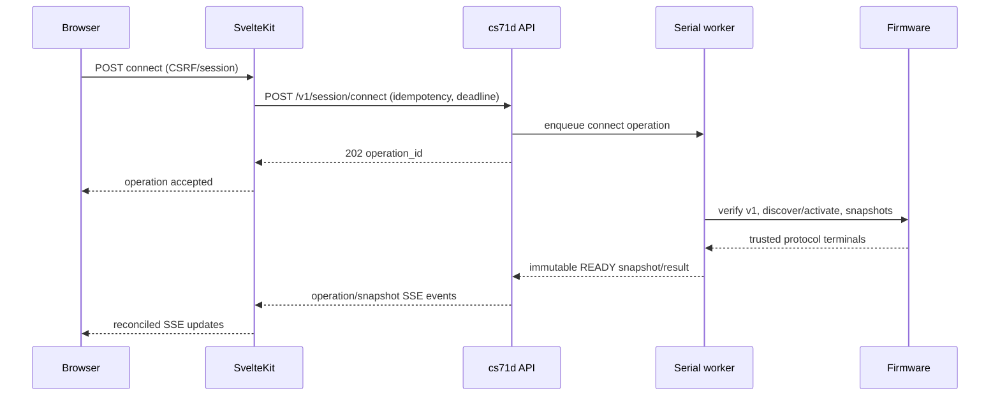
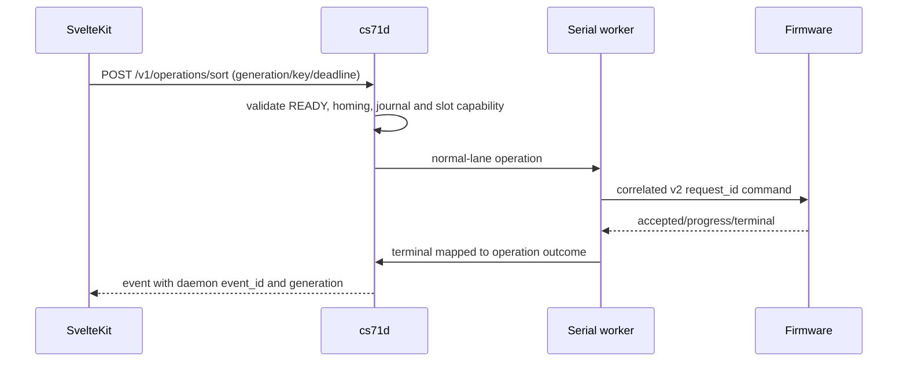

# Runtime and Domain Design

## Components and ownership

`cs71d` contains an internal HTTP/JSON adapter, a domain scheduler, immutable snapshot publisher, event ring, SQLite journal and **one dedicated serial worker thread**. The worker is the only code permitted to instantiate/use `ProtocolClient` or open the controller device. The async/API threads only enqueue typed commands and consume published immutable results. The existing host package remains the wire boundary; no daemon code reimplements parsing, CRC, request tracking or recovery.

SvelteKit is a Node.js SSR BFF/UI. It owns browser sessions, authorization, CSRF checks, user-facing input validation, `web.db`, SSR rendering and the browser SSE bridge. It calls `cs71d` through the Unix domain socket only. Restarting SvelteKit must not close the socket's peer daemon, signal the serial worker, or cancel an operation.

## Queues, operations and state

The scheduler has a bounded normal FIFO lane and a one-slot coalesced priority-stop lane. It permits exactly one active state-changing operation. Read-only snapshot reads consume published data; protocol reads that need the serial session are scheduled only when their lifecycle contract permits. Queue saturation is a visible `QUEUE_FULL` rejection, not unbounded memory growth.

A daemon `operation_id` is a UUID created before enqueue and retained for the idempotency retention period. Lifecycle is `QUEUED → ACCEPTED → RUNNING → {SUCCEEDED, FAILED, CANCELLED, UNCERTAIN}`. `SUCCEEDED` requires the trusted firmware terminal associated with the command. A firmware `request_id` is a session-scoped unsigned protocol correlation value, can wrap, and is never an API operation identifier.

| State family | Values | Meaning |
| --- | --- | --- |
| Connection | `DISCONNECTED`, `CONNECTING`, `VERIFYING_V1`, `ACTIVATING_V2`, `READY`, `RECOVERING`, `UNCERTAIN` | Session confidence, not physical safety. |
| Operation | lifecycle above | Durable command outcome. |
| Fault | `CLEAR`, `ACTIVE`, `LATCHED`, `UNCERTAIN` | `UNCERTAIN` blocks dependent motion until verified recovery. |
| Snapshot | monotonically increasing generation | Immutable machine view; any material state, fault, operation or readiness change increments it. |

`READY` means verified protocol/session and required snapshots exist. It does not assert homing, safe surroundings or operating permission.

## Stale snapshots, idempotency and deadlines

A state-changing request carries `Idempotency-Key`, `If-Match-Generation`, and `X-Deadline-Ms`. The daemon atomically evaluates the idempotency key, authorization-attribution metadata, generation and admission state before creating/reusing an operation. Same key plus same canonical request returns the original operation; same key plus different request returns conflict. A mismatched snapshot generation returns `STALE_GENERATION` without serial I/O. A deadline is finite and bounded by daemon policy; expiry before dispatch fails the operation. Expiry after transmission produces `UNCERTAIN` unless a trusted terminal was already recorded.

## Stop and recovery

Priority stop bypasses normal queued work and asks the worker to issue the exact universal `stop` handling supplied by `ProtocolClient.out_of_band_stop()`. It invalidates queued/active assumptions and creates/reuses a stop operation. It reports whether a trusted `stopped` terminal arrived. It is a **software stop, not an E-stop**. If stop transport/correlation is unsafe, the daemon marks affected work `UNCERTAIN`, attempts the protocol library's conservative recovery where permitted, and never fabricates a stopped/success state.

Reconnect starts from `DISCONNECTED`; it does not replay incomplete commands. The worker closes/releases the old transport, applies the configured device policy, verifies v1, discovers/activates v2 when available, gathers required snapshots, and only then publishes `READY`. Reset and POSIX DTR behavior are gated by the DTR qualification plan; an unqualified Linux open is not a production recovery path.

## Event delivery and backpressure

Every daemon event receives a monotonic daemon `event_id`, `occurred_at`, `generation`, type and optional `operation_id`. The bounded ring is durable enough for the configured local retention and is independent of protocol event `sequence`. Slow subscribers receive no unbounded queue: if their cursor falls behind retained events, the stream emits `snapshot.required` and closes/requires snapshot reconciliation. Heartbeats prevent idle intermediary timeouts. The BFF may fan out to browsers, but browser backpressure cannot block the serial worker.

## Key sequences

### Connect



### Sort



### Priority stop

```mermaid
sequenceDiagram
    participant W as SvelteKit
    participant D as cs71d
    participant S as Serial worker
    participant F as Firmware
    W->>D: POST /v1/machine/stop
    D->>D: preempt normal admission; journal intent
    D->>S: priority stop lane
    S->>F: exact universal stop
    F-->>S: exact stopped terminal or fault
    S-->>D: trusted stop / UNCERTAIN
    D-->>W: operation and snapshot event
```

### Recovery after disconnect

```mermaid
sequenceDiagram
    participant S as Serial worker
    participant D as cs71d
    participant F as Firmware
    S-->>D: transport loss
    D->>D: increment generation; mark active work UNCERTAIN
    D-->>D: publish disconnected/UNCERTAIN event
    D->>S: explicit recovery operation
    S->>F: reset/verify only under qualified policy
    F-->>S: Ready, discovery and trusted snapshots
    S-->>D: READY or remaining UNCERTAIN
```

The API encoding of these rules is canonical in [api-and-events.md](api-and-events.md); safety constraints are canonical in [security-and-safety.md](security-and-safety.md).
