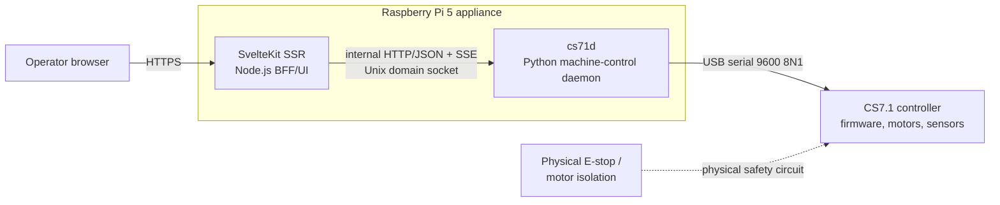
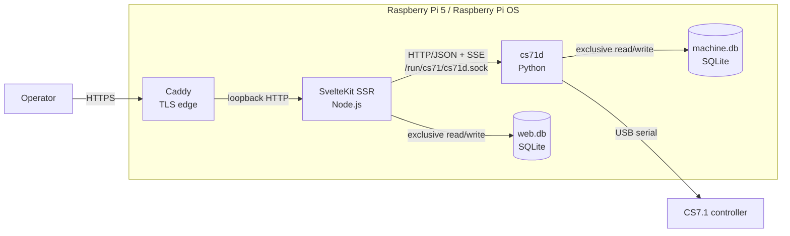

# System Context and Containers

## C4 system context

The browser cannot reach the Unix domain socket, serial device, controller, or daemon API. SvelteKit authenticates and authorizes intent; it does not own motion timing. Firmware controls low-level movement and is not a proof that physical motion completed unless a trusted terminal and HIL evidence support the specific claim. The E-stop path is outside software control.

## C4 container view

`web.db` and `machine.db` are distinct stores with no shared writes; cross-service correlation uses `operation_id`. See [data-and-persistence.md](data-and-persistence.md).

## Trust boundaries

| Boundary | Rule |
| --- | --- |
| Browser → Caddy/SvelteKit | Treat all input, cookies and SSE reconnect headers as hostile; enforce authentication, RBAC, CSRF and validation. |
| SvelteKit → `cs71d` | Local authenticated service boundary via Unix socket permissions; BFF maps users to attributable command metadata. It is not a public API. |
| `cs71d` → controller | Only the serial worker opens the configured stable device; parsing/correlation uncertainty is fail-closed. |
| Software → physical plant | Software stop is a requested firmware command, not a safety-rated E-stop; physical isolation remains independent. |

## External dependencies and failure domains

| Dependency/failure domain | Impact | Required behavior |
| --- | --- | --- |
| Browser or browser SSE connection | Lost presentation only. | SvelteKit resumes or obtains a snapshot; no serial action is retried by browser reconnect. |
| Caddy/SvelteKit restart | Web unavailable or sessions may require revalidation. | `cs71d` and serial worker continue; active daemon operation is unaffected. |
| Unix socket/daemon failure | BFF cannot control/observe. | UI reports unavailable; daemon restart recovers conservatively. |
| USB adapter/device loss | Machine state may be unknown. | `cs71d` marks `UNCERTAIN`/disconnected, invalidates motion assumptions and requires verified recovery. |
| Firmware parse, CRC, timeout or interleaving fault | Correlation is unsafe. | `cs71d` follows `cs71_protocol` recovery; no success result. |
| SQLite/journal or disk fault | Durable audit/lifecycle may be incomplete. | Surface fault and block new state-changing operations; never silently continue. |
| Power loss | Process and physical state may diverge. | On restart, assume no prior operation completion; re-establish verified session and require recovery/homing policy. |

Detailed runtime behavior is canonical in [runtime-and-domain.md](runtime-and-domain.md).
